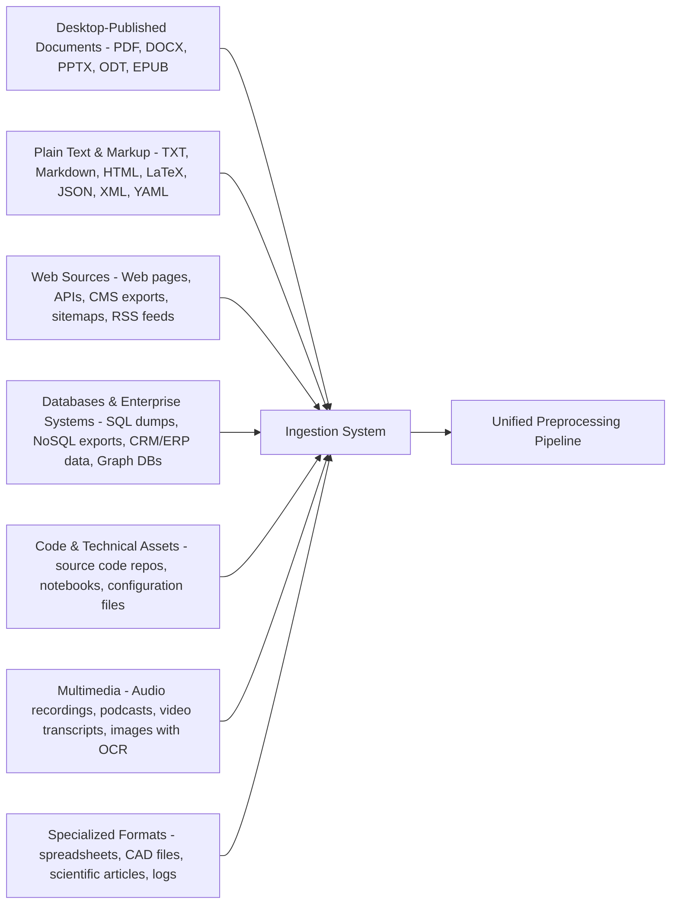

# LLM RAG Systems

*NOTE: THIS PRESENTATION IS MAINLY GENERATED BY CHATGPT AND NOT YET FULLY VERIFIED. DO NOT TRUST.*

## Overview & Structure

- Part 1: Data preparation & ingestion (how your knowledge gets into the system)
- Part 2: Retrieval & context engineering (how you get the right info to the LLM)
- Each part: general design first, then choices & trade-offs, with mermaid flows.


## Information Types & Sources — High-Level Overview

A RAG ingestion system must handle a wide variety of formats and content origins.



This overview highlights the diversity of real-world formats a complete RAG ingestion system may need to support, from documents to APIs to multimedia and enterprise data.


## Part 1 — Framework-based ingestion (Ragflow & Langflow)

How no-code / low-code RAG builders guide ingestion choices.
        
- **Source connectors**: drag‑and‑drop blocks for files, URLs, APIs, databases.
- **Automatic cleaning**: HTML stripping, PDF parsing, OCR add-ons.
- **Configurable chunking**: fixed-size, semantic, overlap tuning.
- **Embeddings**: choose model, batching size, error handling.
- **Vector store integrations**: Pinecone, Weaviate, Qdrant, Chroma.
- **Workflow orchestration**: ingestion flows that run manually or on schedule.


### Ragflow ingestion options

- **Document loaders**: PDFs, Office docs, HTML, Markdown, images (OCR), audio transcripts.
- **Web crawling**: sitemap ingest, depth control, rate limiting, auto-cleaning.
- **Database ingestion**: SQL query blocks, auto-pagination, incremental loads.
- **Preprocessing blocks**: deduplication, text cleaning, language detection.
- **Chunking panel**: semantic or token-based, adjustable overlap, preview before embedding.
- **Embedding model selector** pick local/cloud models; show cost estimates.
- **Vector DB block**: plug into Pinecone, Qdrant, Milvus; configure metadata fields.

### Langflow ingestion options

- **Loader nodes**: URL loader, text loader, directory loader, S3 loader.
- **Transform nodes**: text splitters (recursive, character, Markdown-aware).
- **Cleaning nodes**: regex cleaning, HTML removal, custom Python transforms.
- **Embedding nodes**: support for OpenAI, HuggingFace, local models.
- **Vector store nodes**: Chroma, FAISS, Pinecone, Weaviate; configurable indices.
- **Scheduling**: build flows that re-run ingestion on a schedule via Langflow API.

### Framework-guided ingestion flow

```mermaid
flowchart LR
  Loader[Source Loader Blocks
(Ragflow / Langflow)] --> Clean[Cleaning Blocks
(HTML strip, OCR, regex)]
  Clean --> Split[Chunking Blocks
(fixed, semantic, overlap)]
  Split --> Embed[Embedding Block
(model choice)]
  Embed --> VDB[Vector DB Block
(metadata mapping)]
  VDB --> Done[Indexed Knowledge Base]
```

## Part 1 — General design: Data preparation & ingestion

Goal: turn raw knowledge into clean, searchable pieces that a retriever can use.

*   Collect sources (documents, databases, web pages, user files)
*   Clean & normalize (formatting, deduplication, OCR where needed)
*   Chunking — split large content into bite-sized, meaningful pieces
*   Embed & index — create dense representations and store them in a vector index
*   Metadata — attach context (author, date, source, type) to improve retrieval

### Information flow — Data preparation (high level)

```mermaid
flowchart LR
  A[Raw sources\n(files, DB, web, email)] --> B[Ingestion pipeline\n(fetch & normalize)]
  B --> C[Cleaning & deduplication]
  C --> D[Chunking & segmentation]
  D --> E[Embedding service\n(vector generation)]
  E --> F[Vector index\n(store & metadata)]
  F --> G[Retriever\n(ANN search / filters)]
  G --> H[LLM prompt assembler\n(context + query]
  style A fill:#f9f,stroke:#333,stroke-width:1px
```


> This flow shows how raw data becomes vectors and then gets used at inference time.

## Part 1 — Key choices & trade-offs

#### 1) Source selection
*   **Wide:** include everything (comprehensive but noisy)
*   **Curated:** only high-value sources (cleaner but risks blind spots)

#### 2) Cleaning & normalization
*   Strip HTML, correct OCR errors, unify date formats
*   Trade-off: more cleaning = better quality but higher prep time

#### 3) Chunking strategy
*   Fixed-size chunks (simple, consistent)
*   Semantic chunks (paragraphs, sections — keeps meaning but needs parsing)
*   Hybrid (limit token size but prefer semantic boundaries)

#### 4) Embedding model
*   General-purpose vs. domain-specific — domain models often help for niche vocabulary
*   Compute & cost trade-offs

#### 5) Index & storage
*   Cloud vector DB (managed, easy) vs self-hosted (flexible, control)
*   Indexing strategy: flat vs. approximate (ANN) — ANN gives speed at slight recall cost

## Part 1 — Implementation patterns (non-technical)

*   **Batch pipelines:** periodic full loads (good for stable data)
*   **Streaming / event-driven:** ingest changes in real time (good for fresh content)
*   **Hybrid:** daily full sync + stream for recent changes

> Choose based on how often your sources change and how fresh results must be.

## Part 2 — General design: Retrieval & Context Engineering

Goal: select the best pieces of knowledge and assemble them into a prompt the LLM can use effectively.

*   Retriever selects candidate chunks from the vector index
*   Reranker (optional) improves ordering and precision
*   Filter & apply business rules (date ranges, trust levels, permissions)
*   Prompt assembly — decide what to include, how to format it, and where to put the user's question
*   Safety & hallucination mitigation — attribution, citations, fallbacks

### Information flow — Retrieval to LLM

```mermaid
flowchart LR
  Q[User query]
  Q --> R[Retriever: ANN search\n(top-K candidates)]
  R --> S[Reranker (optional)\n(re-score & order)]
  S --> T[Filter rules\n(trust, recency, permissions)]
  T --> U[Context assembler\n(select & format snippets)]
  U --> V[LLM + prompt\n(includes context + question)]
  V --> W[Response post-processing\n(cite, check hallucination)]
  style Q fill:#fffae6,stroke:#333
```


> This flow focuses on selection, ordering, and assembly of context for the LLM.

## Part 2 — Design choices & trade-offs

#### 1) Retriever type
*   **Dense vector search:** good for semantic matches, handles synonyms well
*   **BM25 / lexical search:** exact term matches — useful for short, specific queries
*   **Hybrid:** combine both for robust recall

#### 2) K (how many candidates to retrieve)
*   Small K (e.g., 3–5): smaller prompt, faster, less noise
*   Large K (e.g., 20+): more coverage but larger prompt — increases cost and risk of irrelevant context

#### 3) Reranking
*   Use a lightweight model or signal-based scoring (recency, source trust) to reorder candidates

#### 4) Context assembly strategies
*   **Concatenate:** simple — paste snippets in order (may confuse the model if noisy)
*   **Template + citation:** summarize each snippet and link to its source — helps traceability
*   **Socratic/Q&A framing:** turn snippets into Q&A pairs the model can use directly

#### 5) Prompt framing
*   Instruction-first (tell the model what to do, then provide context)
*   Context-first (give context, then ask the question)
*   Few-shot examples can guide answer style and guardrails

## Practical patterns & examples

#### Low-cost FAQ assistant
*   Curate top FAQs, chunk by question, embed and index.
*   Retriever: dense vectors; K=3; concatenate snippets into a short prompt.

#### Fresh news assistant
*   Stream ingestion; add timestamps; heavy recency filtering; reranker that prioritizes recent sources.

#### Compliance-aware enterprise assistant
*   Strong metadata filters (sensitivity labels), strict source whitelists, human-in-the-loop review for uncertain answers.

### Hybrid retrieval example (mermaid)

```
flowchart LR
  UserQ --> Dense[Dense retriever (vectors)]
  UserQ --> Lexical[BM25 / lexical]
  Dense --> Combine[Combine & dedupe]
  Lexical --> Combine
  Combine --> Rerank[Rerank (signals: recency, trust)]
  Rerank --> Assemble[Assemble context + citations]
  Assemble --> LLM
```


## Mitigations & Best Practices

*   Monitor retrieval quality (A/B test different K and rerankers)
*   Log sources used for each answer — builds trust and enables audits
*   Limit token budgets — trim long snippets, prioritize salient parts
*   Provide explicit fallback messages when confidence is low
*   Keep a human review path for sensitive domains

## Quick checklist to get started

1.  Inventory your sources and decide curation strategy
2.  Choose chunking rules (semantic + token limits)
3.  Pick an embedding model and vector store
4.  Design retriever + reranker + assembly pipeline
5.  Deploy monitoring, logging, and review processes

## Summary

Two pillars of RAG: prepare your data carefully, then design retrieval to present concise, trustworthy context to the LLM.

Decisions are trade-offs: accuracy vs. latency vs. cost vs. freshness. Start simple and iterate.

> Questions? Tell me which slide you'd like to expand or convert into handouts.